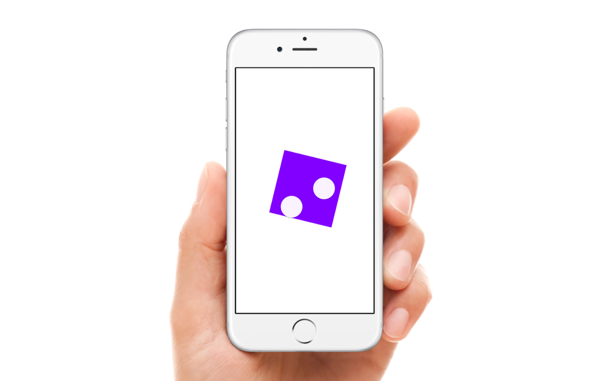
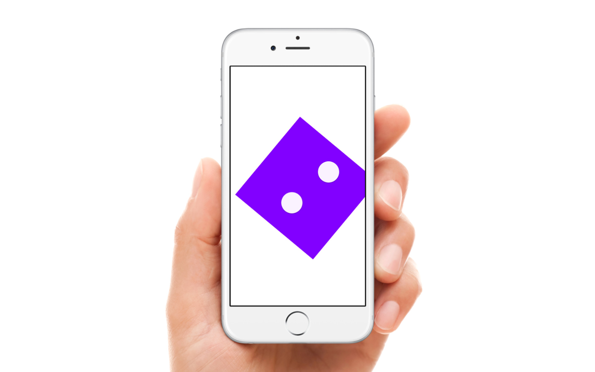
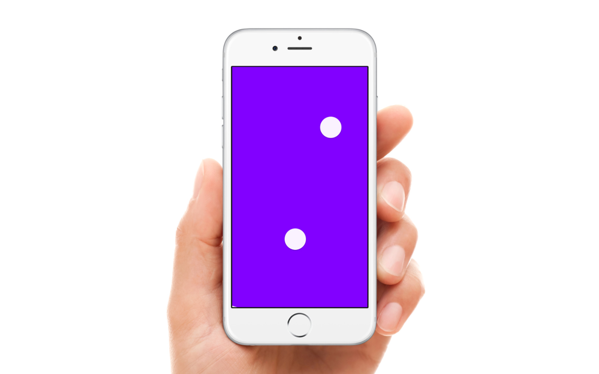
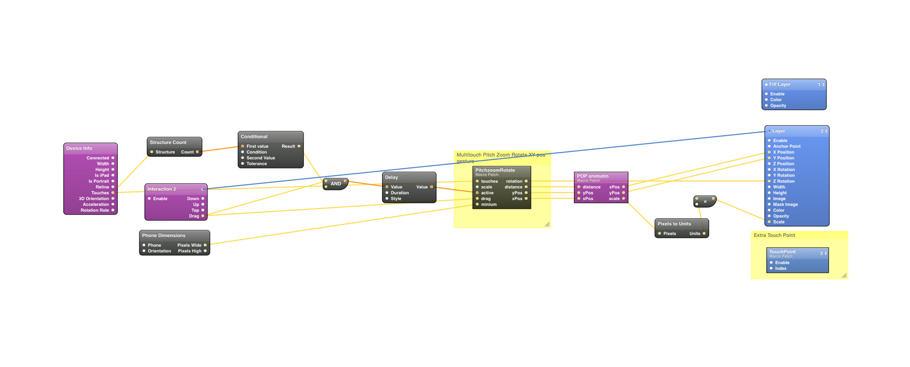

# Origami-PinchZoomRotate
Example of a Pinch, Zoom and Rotate Gesture for Orgami

===========

More example found at http://www.justaddmusicmedia.com/work/prototypes/

Tutorial composition on builting a Pinch, Zoom, Rotate, XY position interaction like demostrated in Facebook's Paper application. 

Built with the prototyping tool Origami (by Facebook)

Email me if you use this composition would be great to check out your work. Have fun learning QC and Origami

Facebook Community discussion and video
https://www.facebook.com/groups/origami.community/permalink/748496958582522/
https://vimeo.com/126592460

## Features
- Mulitouch gestures
- Pinch to shrink and Zoom
- Pinch and Rotate 
- Dragging
- POP bounce animations
- 

## How to Use
- Clone this repo
- Open the QC folder
- Open the **.qc files**
- Have fun!

## Dependencies
Requires [Quartz Composer](https://developer.apple.com/downloads/download.action?path=Developer_Tools%2Fgraphics_tools_for_xcode__xcode_6.1%2Fgraphicstools_for_xcode_6.1.dmg "Quartz Composer") and [Origami](http://facebook.github.io/origami/download/ "Origami") 

